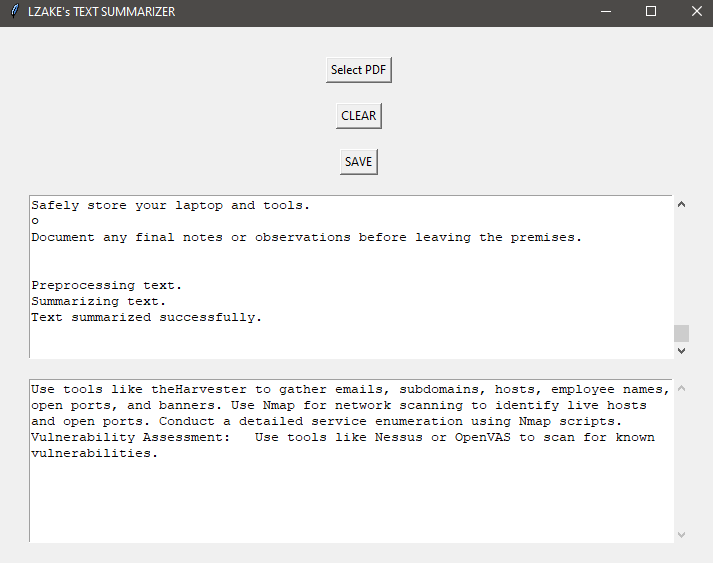

Sure! Here's a README file for your `pdf_summarizer.py` project:

### README

# PDF Summarizer

`pdf_summarizer.py` is a Python application that extracts text from PDF files, summarizes the content using a pre-trained BART model, and provides a GUI for easy interaction. The GUI allows users to select a PDF file, view the extracted text, clear the text, and save the summary.



## Features

- Extracts text from PDFs, including images with OCR.
- Summarizes extracted text using a pre-trained BART model.
- GUI for selecting PDFs, viewing extracted text, and saving summaries.
- Utilizes GPU for faster processing if available.

## Installation

### Prerequisites

- Python 3.6 or higher
- Tesseract OCR

### Step 1: Install Tesseract OCR

1. Download the Tesseract installer from the [Tesseract at UB Mannheim GitHub page](https://github.com/UB-Mannheim/tesseract/wiki).
2. Run the installer and follow the prompts. By default, Tesseract will be installed in `C:\Program Files\Tesseract-OCR`.
3. Ensure that the Tesseract installation directory is added to your system PATH.

### Step 2: Clone the Repository and Install Dependencies

1. Clone the repository:
   ```bash
   git clone https://github.com/yourusername/pdf_summarizer.git
   cd pdf_summarizer
   ```

2. Create a virtual environment (optional but recommended):
   ```bash
   python -m venv myenv
   myenv\Scripts\activate  # On Windows
   ```

3. Install the required Python packages:
   ```bash
   pip install torch transformers pytesseract PyMuPDF Pillow
   ```

### Step 3: Create Configuration File

1. Create a `config.json` file in the project directory with the following content:
   ```json
   {
       "tesseract_cmd": "C:\\Users\\AnonZanon\\AppData\\Local\\Programs\\Tesseract-OCR\\tesseract.exe"
   }
   ```
   Adjust the path to Tesseract OCR if necessary.

### Step 4: Add Configuration File to `.gitignore`

Add `config.json` to your `.gitignore` file to ensure it is not tracked by Git:

```gitignore
config.json
```

## Usage

1. Run the Python script:
   ```bash
   python pdf_summarizer.py
   ```

2. The GUI will open with the title "LZAKE's TEXT SUMMARIZER".

3. Use the buttons in the GUI to:
   - **Select PDF**: Open a file dialog to select a PDF file. The extracted text and summary will be displayed in the text widgets.
   - **CLEAR**: Clear the text in the output and summary widgets.
   - **SAVE**: Save the summary text to a file.

### GUI Overview

- **Select PDF**: Opens a file dialog to select a PDF file for processing.
- **CLEAR**: Clears the text in the output and summary widgets.
- **SAVE**: Saves the summary text to a file.

## Example

Below is an example of what the GUI looks like when running the script:


## Troubleshooting

- Ensure that Tesseract OCR is installed and its path is correctly set in the `config.json` file.
- Verify that your Python environment has all the required packages installed.

## License

This project is licensed under the MIT License. See the [LICENSE](LICENSE) file for details.

---

This README provides clear instructions for installing and using the `pdf_summarizer.py` application, including a screenshot of the GUI to illustrate what it looks like.